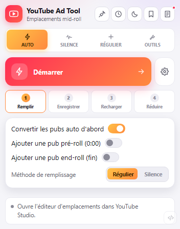
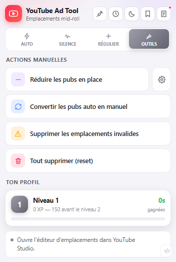
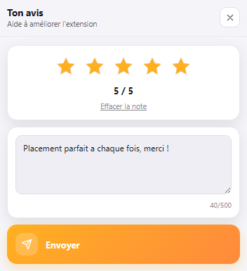

# YouTube Ad Tool

Place et nettoie les emplacements d'annonce mid-roll de YouTube Studio à ta place — remplissage automatique, silences, réduction, presets partageables.

[**⬇ Télécharger**](https://github.com/Slipers/youtube-ad-tool/releases/latest) · [Releases](https://github.com/Slipers/youtube-ad-tool/releases)

## Ce qu'elle fait

YouTube Ad Tool est une extension de navigateur pour **un problème précis** : une fois ta vidéo publiée, YouTube Studio te laisse placer des emplacements de pub mid-roll un par un, à la main, en faisant glisser chaque marqueur sur la timeline. Sur une vidéo de 40 minutes avec une pub toutes les 2 minutes, ça fait des dizaines de clics — puis il faut souvent nettoyer les emplacements que YouTube a invalidés après coup.

L'extension enchaîne tout ça pour toi : remplissage (silences détectés ou intervalle fixe), enregistrement, rechargement de la page, réouverture de l'éditeur, suppression des emplacements refusés par YouTube, puis réduction au nombre ou à la fréquence que tu veux.

> À utiliser **une fois la vidéo publiée**, depuis ses paramètres → onglet
> **Monétisation** → *Vérifier le placement des mid-rolls*.

## Pourquoi pas juste le faire à la main dans YouTube Studio ?

Rien n'empêche de tout placer à la main — c'est littéralement ce que fait cette extension, en pilotant les mêmes boutons. Mais répéter l'opération sur chaque vidéo publiée, vérifier chaque emplacement invalidé, et recommencer le calcul d'espacement à chaque fois, ça devient vite le genre de tâche répétitive qu'on veut ne plus jamais refaire manuellement.

## Fonctionnalités

- ⚡ **Mode Auto** — un seul clic : remplissage, enregistrement, rechargement, réouverture, nettoyage et réduction enchaînés automatiquement
- 🔇 **Silence** — lit la forme d'onde de l'éditeur et place une pub au milieu de chaque silence détecté
- ⏱️ **Régulier** — une pub à intervalle fixe sur toute la vidéo
- 🎯 **Pré-roll (0:00) et end-roll (fin)** — toujours conservés lors de la réduction, jamais retirés par erreur
- 🧰 **Outils** — réduction manuelle, conversion des pubs automatiques en manuelles, suppression des emplacements invalides, remise à zéro
- 💾 **Presets partageables** — enregistre tes réglages et partage-les avec un code
- 📌 **Épinglage** — détache l'extension dans une fenêtre qui reste ouverte pendant tout le parcours automatique
- ⭐ **Notation intégrée** — note l'extension (étoiles + commentaire) depuis le menu développeur ou en fin de placement
- 🌗 **Thème clair / sombre**
- 🏆 **Niveaux et XP** — suit le temps que l'extension t'a fait gagner

&nbsp;&nbsp;

## Installation

1. [Télécharge le `.zip`](https://github.com/Slipers/youtube-ad-tool/releases/latest) et décompresse-le — pas d'installeur, rien à builder.
2. Ouvre `chrome://extensions` (ou `opera://extensions`).
3. Active le **mode développeur**.
4. Clique sur **Charger l'extension non empaquetée** et choisis le dossier décompressé.
5. Ouvre une vidéo publiée dans YouTube Studio, onglet **Monétisation** → *Vérifier le placement des mid-rolls*, puis lance l'extension.

## Comment ça marche

Sous le capot, l'extension pilote directement les boutons de l'éditeur d'emplacements de YouTube Studio (remplissage, enregistrement, suppression) via `chrome.scripting`, et lit la forme d'onde publiée par l'éditeur pour détecter les silences — la même interface que tu utiliserais à la main, juste automatisée.

## Mises à jour

Une extension chargée en mode développeur ne se met pas à jour toute seule par défaut : télécharge la nouvelle version, remplace le dossier, puis clique sur la flèche de rechargement dans la page des extensions.

Elle peut aussi le faire pour toi : au premier clic sur *Mettre à jour maintenant*, tu désignes une fois le dossier de l'extension, et chaque mise à jour suivante se fait ensuite en un clic. Cette fonctionnalité ne s'active que sur les installs en mode développeur — une extension installée depuis le Chrome Web Store est mise à jour par Chrome lui-même, en silence.

## Permissions

| Permission | Pourquoi |
| --- | --- |
| `studio.youtube.com` | Lire et modifier les emplacements d'annonce de tes vidéos |
| `raw.githubusercontent.com` | Lire `version.json` pour détecter les mises à jour (mode développeur uniquement) |
| `discord.com` | Envoyer ta note et ton commentaire, si tu utilises le système de notation |
| `scripting`, `activeTab` | Exécuter les actions dans la page YouTube Studio |
| `storage` | Conserver tes réglages, presets et statistiques en local |

Aucune donnée ne quitte ton navigateur en dehors de ces deux cas explicites (vérification de version, envoi d'une note) : les réglages restent en stockage local.

## Licence

[MIT](LICENSE)
